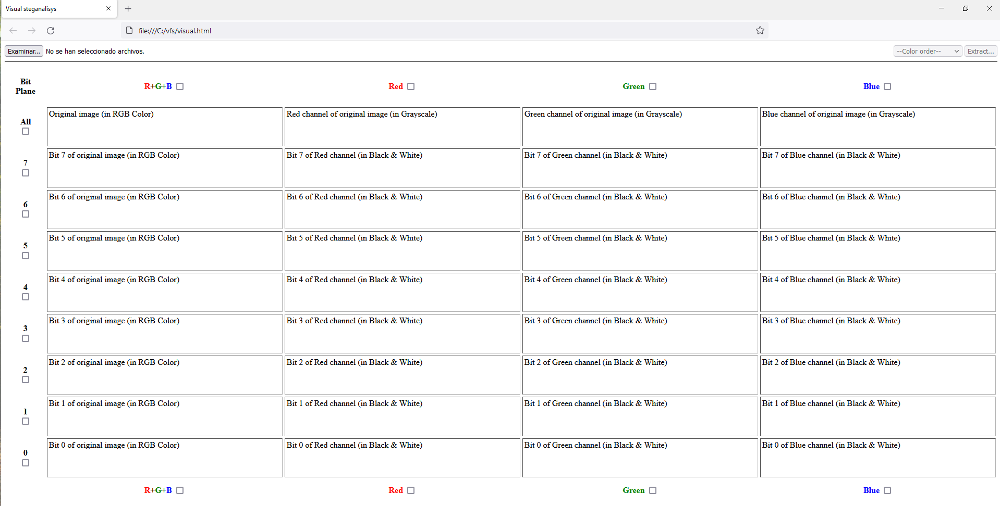

# Visual Forensic Steganography

The VFS tool allows to perform visual attacks on different digital image formats. This feature is very useful for detecting the use of certain steganographic techniques, especially LSB (Least Significant Bit), and for malware analysts analyzing pieces of stegomalware. All this without uploading the information to untrusted third-party services.

It is very easy to use. Simply open the web page with our JavaScript code (visual.html), open the digital image, visualize the visual attack by color plane and extract the information according to the selection.

# Examples

# Author & license

This project has been developed by Dr. Manuel Urueña (@muruenya) y Dr. Alfonso Muñoz (@mindcrypt). The code is released under the GNU General Public License v3.

